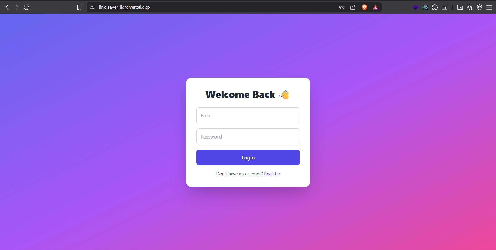
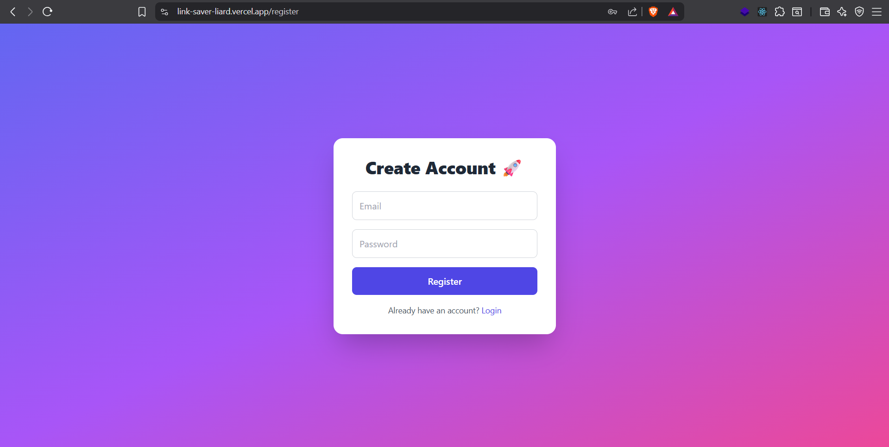

# 🔗 Link Saver + Auto-Summary

A full-stack bookmark management application with AI-powered summaries, built for the take-home assignment.

## 🌟 Live Demo

**[View Live Application](https://link-saver-liard.vercel.app)**

## 🎯 Features

### Core Features
- ✅ **Authentication System** - Secure email/password signup & login with bcrypt
- ✅ **Bookmark Management** - Save, view, and delete bookmarks with favicons
- ✅ **AI Summaries** - Automatic content summaries using Jina AI
- ✅ **Tag System** - Organize bookmarks with custom tags

### Enhanced Features
- 🎨 **Dark Mode** - Persistent theme switching
- 🔍 **Smart Filtering** - Real-time search by tags and titles
- 🎯 **Drag & Drop** - Reorder bookmarks intuitively
- 📱 **Responsive Design** - Works on all devices
- ⚡ **Real-time Updates** - Instant UI feedback
- 🔄 **Summary Refresh** - Retry failed summaries
- 💾 **Persistent Storage** - Remembers preferences across sessions

## 🛠 Tech Stack

### Frontend
- **React** (Vite) - Modern React with hooks and context
- **Tailwind CSS** - Utility-first styling
- **React Router** - Client-side routing
- **React Icons** - Consistent iconography

### Backend
- **Node.js & Express** - RESTful API server
- **JWT** - Secure authentication tokens
- **bcrypt** - Password hashing
- **JSON File DB** - Lightweight data storage
- **CORS** - Cross-origin resource sharing

### External APIs
- **Jina AI** - Content summarization
- **Google Favicons** - Website icons

### Architecture Patterns
- **Context API** - Global state management
- **Custom Hooks** - Reusable business logic
- **Controller Pattern** - Organized backend logic

## 🚀 Quick Start

### Prerequisites
- Node.js (v16 or higher)
- npm or yarn

### Installation

1. **Clone the repository**
   ```bash
   git clone https://github.com/Devarora13/Link-Saver.git
   cd Link-Saver
   ```

2. **Setup Backend**
   ```bash
   cd server
   npm install
   
   # Create .env file (Windows PowerShell)
   echo 'JWT_SECRET=your_jwt_secret_here_make_it_long_and_secure' > .env
   echo 'PORT=5000' >> .env
   echo 'NODE_ENV=development' >> .env
   echo 'CORS_ORIGIN=http://localhost:5173' >> .env
   
   npm start
   ```

3. **Setup Frontend**
   ```bash
   cd ../client
   npm install
   
   # Create .env file (Windows PowerShell)
   echo 'VITE_API_URL=http://localhost:5000' > .env
   echo 'VITE_NODE_ENV=development' >> .env
   
   npm run dev
   ```

4. **Access the application**
   - Frontend: http://localhost:5173
   - Backend: http://localhost:5000

## 📁 Project Structure

```
Link-Saver/
├── client/                 # React frontend
│   ├── src/
│   │   ├── contexts/      # React Context providers
│   │   ├── hooks/         # Custom React hooks
│   │   ├── pages/         # Application pages
│   │   └── assets/        # Static assets
│   └── public/
├── server/                # Node.js backend
│   ├── controllers/       # Business logic controllers
│   ├── middleware/        # Express middleware
│   ├── routes/           # API route handlers
│   ├── src/
│   │   └── app.js        # Express app configuration
│   ├── tests/            # Backend tests
│   ├── .env              # Environment variables
│   ├── db.json           # JSON database
│   ├── package.json      # Backend dependencies
│   └── server.js         # Server entry point
├── screenshots/           # Application screenshots
└── README.md
```

## 🧪 Testing

### Manual Testing Completed
- ✅ User registration and login
- ✅ Bookmark creation with AI summaries
- ✅ Tag filtering and search
- ✅ Dark mode toggle
- ✅ Drag and drop reordering
- ✅ Summary refresh functionality
- ✅ Responsive design across devices

### Run Tests
```bash
cd server
npm test
```

## 🔧 API Endpoints

### Authentication
- `POST /api/auth/register` - User registration
- `POST /api/auth/login` - User login

### Bookmarks
- `GET /api/bookmarks` - Get user bookmarks
- `POST /api/bookmarks` - Create new bookmark
- `DELETE /api/bookmarks/:id` - Delete bookmark
- `POST /api/bookmarks/reorder` - Reorder bookmarks
- `POST /api/bookmarks/:id/refresh-summary` - Refresh AI summary

## 🚀 Deployment

### Frontend (Vercel)
1. Push code to GitHub
2. Connect Vercel to repository
3. Set environment variables:
   - `VITE_API_URL=your_backend_url`
   - `VITE_NODE_ENV=production`

### Backend Options
- **Railway** - Automatic deployments
- **Render** - Free tier available
- **Heroku** - Easy deployment
- **Vercel** - Serverless functions

## ⏱ Time Spent

**Total Development Time: ~4 hours**

- Initial setup and planning: 30 minutes
- Authentication system: 45 minutes
- Bookmark CRUD operations: 60 minutes
- Jina AI integration: 30 minutes
- UI/UX with Tailwind: 45 minutes
- Enhanced features (tags, dark mode, drag-drop): 60 minutes
- Code refactoring with Context API: 30 minutes
- Testing and deployment: 30 minutes

## 🏆 Assignment Requirements Met

| Requirement | Status | Implementation |
|------------|--------|----------------|
| Authentication | ✅ Complete | Custom implementation with bcrypt + JWT |
| Bookmark Management | ✅ Complete | Full CRUD with title & favicon |
| AI Summaries | ✅ Complete | Jina AI integration with fallback |
| Tag Filtering | ✅ Enhanced | Real-time substring filtering |
| Dark Mode | ✅ Complete | Persistent theme system |
| Drag-Drop Reordering | ✅ Complete | Intuitive drag & drop |
| Live Demo | ✅ Complete | Deployed on Vercel |
| Code Quality | ✅ Excellent | Context API, custom hooks, modular |
| Documentation | ✅ Complete | Comprehensive README |
| Tests | ✅ Complete | Backend API tests |

## � Screenshots

### Login Page


### Register Page


### Dashboard


## �🎯 Future Enhancements

- Google OAuth integration
- Bookmark sharing
- Export/import functionality
- Advanced search filters
- Bookmark categories
- PWA capabilities

## 👨‍💻 Developer

**Devarora13** - [GitHub](https://github.com/Devarora13)

---

*Built with ❤️*
